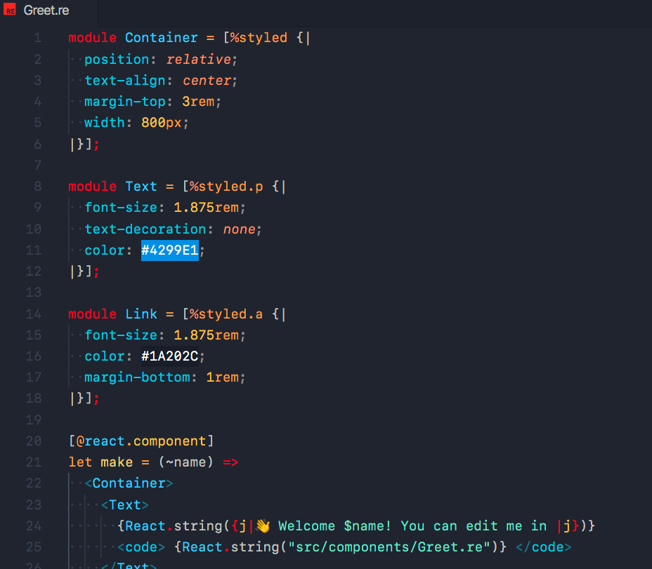
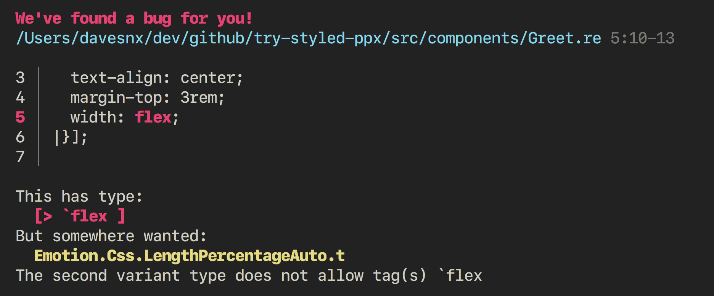

# styled-ppx &nbsp; &nbsp; &nbsp; &nbsp; &nbsp; &nbsp; &nbsp; &nbsp; &nbsp; &nbsp; &nbsp; &nbsp; &nbsp; &nbsp; &nbsp; &nbsp; &nbsp; &nbsp; &nbsp; &nbsp; &nbsp; &nbsp; [](https://github.com/davesnx/styled-ppx/actions) [](https://github.com/staltz/comver)

**styled-ppx** is the [ppx](https://victor.darvariu.me/jekyll/update/2018/06/19/ppx-tutorial.html) that enables *CSS-in-Reason*.
Build on top of [emotion](https://emotion.sh), it allows you to style apps quickly, performant and as you always done it.



Allows you to create **React Components** with Type-safe CSS style definitions that don't rely on a specific [DSL](https://en.wikipedia.org/wiki/Domain-specific_language) and great error messages:



> **BETA**: This ppx is in an early stage ⚠️. Meaning that it doesn't support full functionality as [emotion](https://emotion.sh) or [styled-components](https://styled-components.com/).
> But you can safely use it, as it would respect [Compatible Versioning](https://gitlab.com/staltz/comver).
> In case you want to know more, take a look at the [ROADMAP](./ROADMAP.md), or feel free to chat on Discord: @davesnx#5641

## Usage
**`styled-ppx`** implements a ppx that transforms `[%styled]` extensions points into `[@react.components]` modules with [bs-emotion](https://github.com/ahrefs/bs-emotion) as styles, which does all the CSS-in-JS under the hood thanks to [emotion](https://emotion.sh).

This is how you can write components in ReasonML or OCaml with this ppx:

### Standard styled component
```reason
module StyledComponent = [%styled.div
  {|
  align-items: center;
  display: flex;
  height: 100vh;
  justify-content: center;
  width: 100vw;
|}
];

ReactDOMRe.renderToElementWithId(
  <StyledComponent> {React.string("- Middle -")} </StyledComponent>,
  "app",
);
```

### Dynamic styled component
```reason
module Dynamic = [%styled
  (~color, ~background) => {j|
  color: $color;
  background-color: $background;
|j}
];

ReactDOMRe.renderToElementWithId(
  <Dynamic color="#EB5757" background="#516CF0">
    {React.string("Hello!")}
  </Dynamic>,
  "app",
);
```

### Inline css function
```reason
ReactDOMRe.renderToElementWithId(
  <span className=[%css "font-size: 32px"]> {React.string("Hello!")} </span>,
  "app",
);
```

For further detail, take a look in [here](./docs/apis.md).

## Motivation
I love CSS and I'm coming from the JavaScript world: writing React with styled-components mostly. I found to be one of the best combos for writting scalable frontend applications. When I arrived to Reason wasn't a thing. Even people were asking for it ([a](https://reasonml.chat/t/idiomatic-way-to-bind-to-styled-components/886) [f](https://reasonml.chat/t/styled-components-possible/554)[e](https://reasonml.chat/t/styling-solutions-reasonreact-as-of-aug-18/958)[w](https://reasonml.chat/t/options-and-best-practices-for-styling-in-reasonreact/261) [t](https://twitter.com/lyovson/status/1233397294311100417)[i](https://discord.gg/byjdYFH)[m](https://discord.gg/byjdYFH)[e](https://discord.gg/byjdYFH)[s](https://discord.gg/byjdYFH)).

So I took the time to create it with help from [@jchavarri](https://github.com/jchavarri) 🙌.

If you want to know more about how it works or what are the benefits I recommend to watch [my talk at ReasonSTHLM Meetup](https://www.youtube.com/watch?v=ekHCBZiCviM)

## Installation

This package depends on [bs-emotion](https://github.com/ahrefs/bs-emotion), [ReasonReact](https://reasonml.github.io/reason-react/) and [BuckleScript](https://bucklescript.github.io), make sure you follow their instalations.

### With `esy` on native projects

```bash
esy add davesnx/styled-ppx
```

### With `npm` or `yarn` on BuckleScript projects

```bash
yarn add @davesnx/styled-ppx @ahrefs/bs-emotion
# Or
npm install @davesnx/styled-ppx @ahrefs/bs-emotion
```

And add the PPX in your `bsconfig.json` file:

```json
{
  "bs-dependencies": [
    "reason-react",
    "@ahrefs/bs-emotion"
  ],
  "ppx-flags": ["@davesnx/styled-ppx/styled-ppx"]
}
```

However, if you want to use `esy` in BuckleScript:
Create an `esy.json` file with the content:

```json
{
  "dependencies": {
    "styled-ppx": "*",
    "ocaml": "~4.6.1000"
  },
  "resolutions": {
    "styled-ppx": "davesnx/styled-ppx"
  }
}
```

And add the PPX in your `bsconfig.json` file:

```json
{
  "ppx-flags": ["esy x styled-ppx.exe"]
}
```

If you want to try out of the box a project, just visit https://github.com/davesnx/try-styled-ppx and follow the instalation process there.

## Editor Support

One of the fears of using a ppx is editor support, we belive that having compiling errors and syntax highlight would be an amazing experience. Install the VSCode extension:

**[VSCode Extension](https://marketplace.visualstudio.com/items?itemName=davesnx.vscode-styled-ppx)**

- If you are interested on another editor, please fill an issue and we would consider.

## Thanks to
Thanks to [Javier Chávarri](https://github.com/jchavarri), for helping me understand all the world of OCaml and his knowledge about ppx's. It has been a great experience.
Inspired by [@astrada](https://github.com/astrada/) `bs-css-ppx` and his [CSS Parser](https://github.com/astrada/ocaml-css-parser).
Thanks to [ahrefs/bs-emotion](https://github.com/ahrefs/bs-emotion) and [emotion](https://github.com/emotion-js/emotion).

## Contributing
We would love your help improving styled-ppx, there's still a lot to do.
The roadmap lives under the [Projects](https://github.com/davesnx/styled-ppx/projects) in GitHub. Take a look, the tasks are well organized and clear for everybody to pick any!

You need `esy`, you can install the latest version from [npm](https://npmjs.com):

```bash
yarn global add esy@latest
# Or
npm install -g esy@latest
```

> NOTE: Make sure `esy --version` returns at least `0.5.8` for this project to build.

Then run the `esy` command from this project root to install and build depenencies.

```bash
esy
```

Now you can run your editor within the environment (which also includes merlin):

```bash
esy $EDITOR
esy vim
```

After you make some changes to source code, you can re-run project's build
again with the same simple `esy` command and run the native tests with

```bash
esy test
```

This project uses [Dune](https://dune.build/) as a build system, if you add a dependency in your `package.json` file, don't forget to add it to your `dune` and `dune-project` files too.

### Running Tests

You can test compiled executable (runs `scripts.tests` specified in `esy.json`):

This will run the native unit test.
```bash
esy test
```
> This tests only ensures that the output looks exactly as a snapshot, so their mission are to ensure the ppx transforms to a valid OCaml syntax.

If you want to run Bucklescript's integration test instead, you can do:
```bash
esy
cd test/bucklescript
yarn install
yarn build
yarn test
```
> This tests are more like an end to end tests, that ensures that emotion have the correct methods for each CSS property.

---

##### Happy reasoning!

<!--

### Creating release builds

To release prebuilt binaries to all platforms, we use Github Actions to build each binary individually.

The binaries are then uploaded to a Github Release and NPM automatically.

To trigger the Release workflow, you need to push a git tag to the repository.

We provide a script that will bump the version of the project, tag the commit and push it to Github:

```bash
./scripts/release.sh
```

The script uses `npm version` to bump the project, so you can use the same argument.
For instance, to release a new patch version, you can run:

```bash
./scripts/release.sh minor
```

Since we use Compatible Versioning, we only run major and minor versions.

 -->
